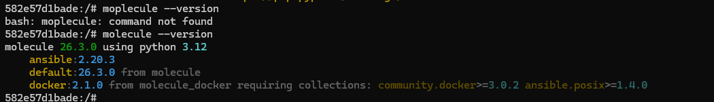
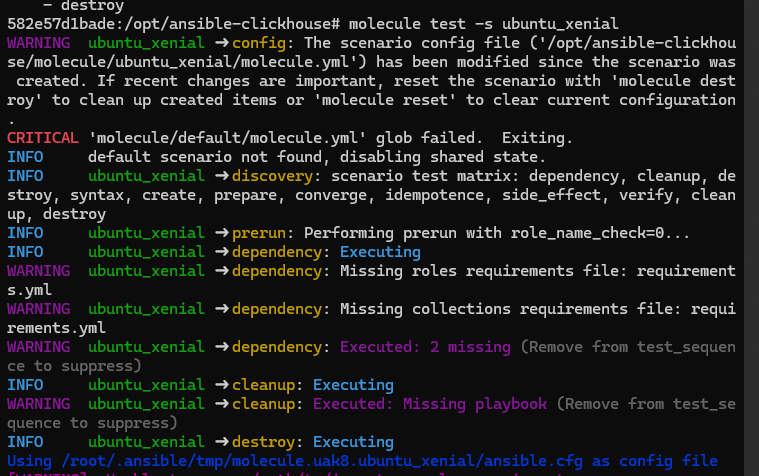
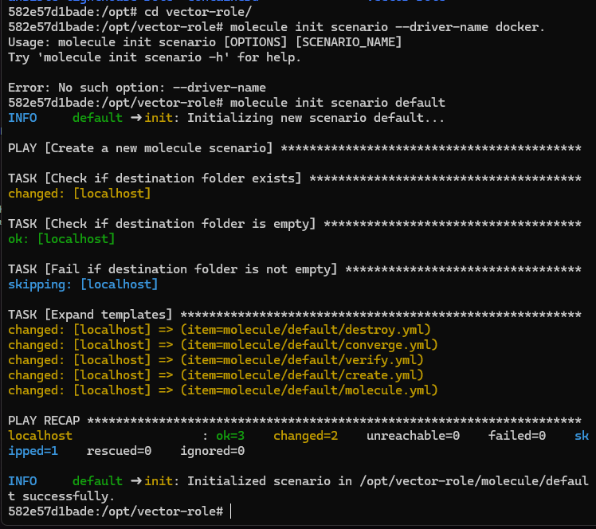
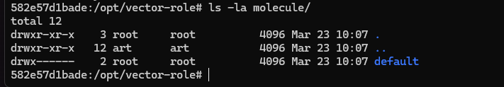
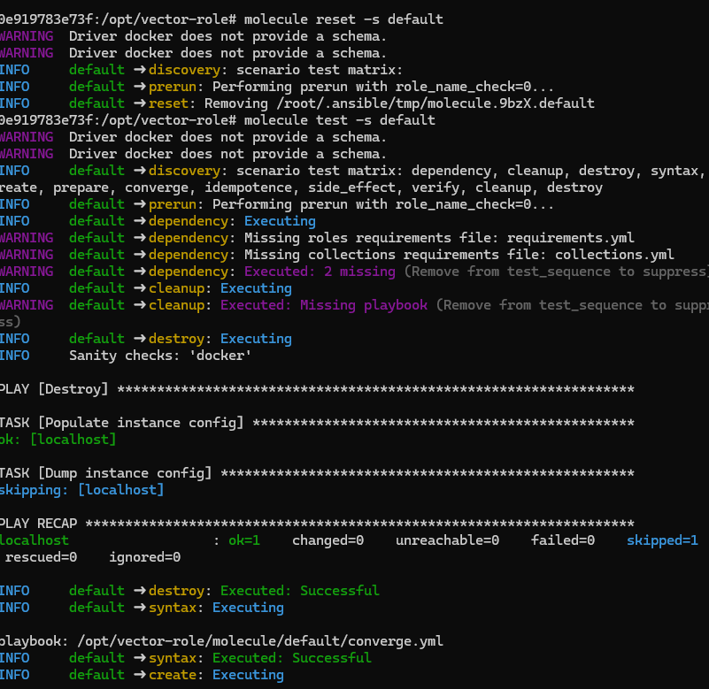
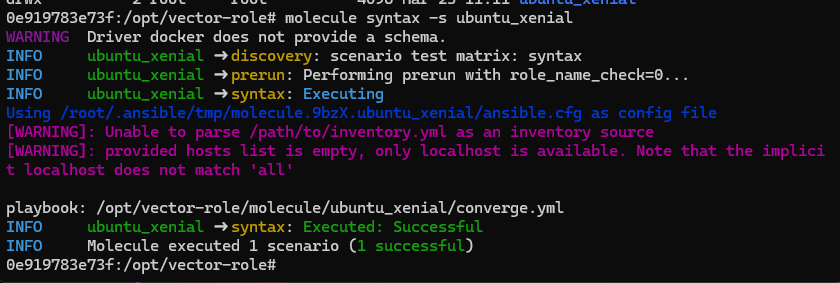
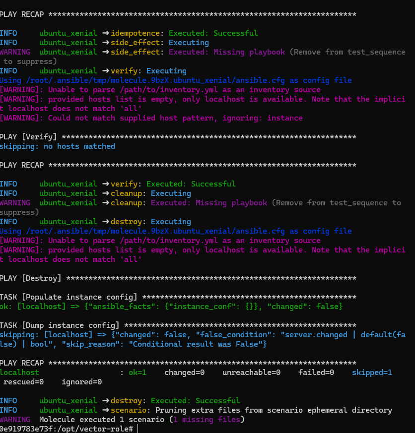
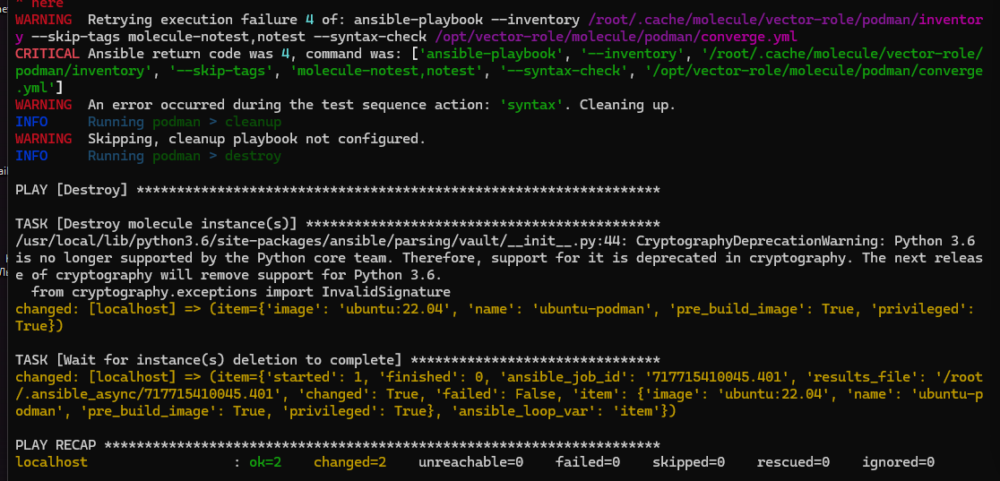

# Соберем новый образ 
```
 docker build -t docker-in-docker -f Dockerfile .
```

```
docker-compose up -d 
```
Установим ```molecule``` в контейнер 
```
docker  exec -it test-roles2  bash

```
```
  pip3 install --break-system-packages --no-cache-dir     --index-url https://pypi.org/simple     --trusted-host pypi.org     --trusted-host files.pythonhosted.org     ansible     ansible-lint     molecule     molecule-docker     docker     pytest     testinfra
```

```
molecule --version
```



### Скачаем роль clickhouse
```
git clone https://github.com/AlexeySetevoi/ansible-clickhouse.git
```
```
cd ansible-clickhouse/

```
Инициализируем 
```
molecule init scenario ubuntu_xenial
```
Запустим тест
```
molecule test -s ubuntu_xenial
```



## протестируем Vector роль 
```
cd vector-role/

```
### Инициализируем сценарий без опций
```
molecule init scenario default
```


```
ls -la molecule/
```

```
 molecule reset -s default
```
```
molecule test -s default
```




```
 molecule init scenario ubuntu_xenial

```
```
molecule syntax -s ubuntu_xenial
```

```
molecule test -s ubuntu_xenial
```



# TOX
```
 docker run --privileged=True -v <path_to_repo>:/opt/vector-role -w /opt/vector-role -it aragast/netology:latest 
 ```


 # Устанавливаем зависимости напрямую
pip install --upgrade pip
pip install 'molecule>=3.0' 'molecule-docker>=1.0' 'pytest>=6.0' 'testinfra>=6.0' 'ansible-lint>=5.0' 'yamllint>=1.26' 'ansible<3.0'


ls -la molecule/

```
mkdir -p molecule/podman

cat > molecule/podman/molecule.yml << 'EOF'
---
dependency:
  name: galaxy
driver:
  name: podman
platforms:
  - name: ubuntu-podman
    image: ubuntu:22.04
    pre_build_image: true
    privileged: true
provisioner:
  name: ansible
  playbooks:
    converge: converge.yml
    prepare: prepare.yml
verifier:
  name: ansible
scenario:
  name: podman
  test_sequence:
    - destroy
    - syntax
    - create
    - prepare
    - converge
    - verify
    - destroy
EOF
```

```
cat > tox.ini << 'EOF'
[tox]
minversion = 3.0
skipsdist = true
envlist = molecule-docker, molecule-podman

[testenv]
deps =
    molecule
    molecule-docker
    molecule-podman
    pytest
    testinfra
    ansible-lint
    yamllint
    docker
    podman
setenv =
    PYTHONPATH = {toxinidir}
    ANSIBLE_FORCE_COLOR = true

[testenv:molecule-docker]
commands =
    molecule test --scenario-name default --destroy always

[testenv:molecule-podman]
commands =
    molecule test --scenario-name podman --destroy always

[testenv:all]
commands =
    molecule test --scenario-name default --destroy always
    molecule test --scenario-name podman --destroy always
EOF
```

```
cat > tox-requirements.txt << 'EOF'
molecule>=3.0
molecule-docker>=1.0
molecule-podman>=1.0
pytest>=6.0
testinfra>=6.0
ansible-lint>=5.0
yamllint>=1.26
docker>=5.0
podman>=4.0
ansible<3.0
EOF
```

```
tox -e molecule-docker
```

# DevOps_Netology_Homework_08-ansible-05_testing_roles_ansible
